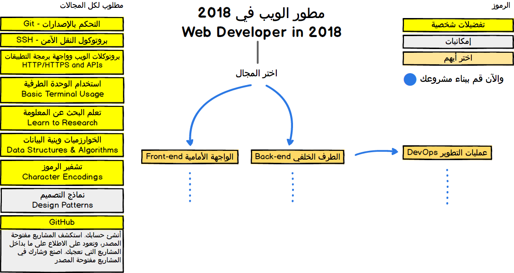
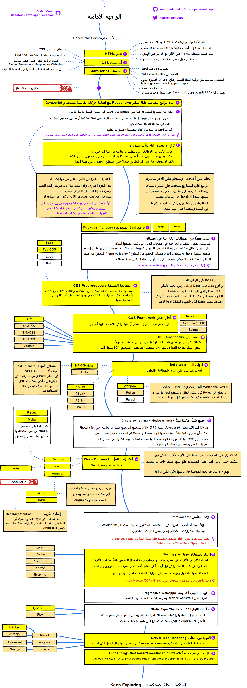
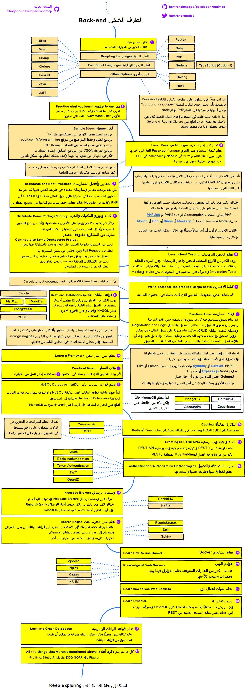
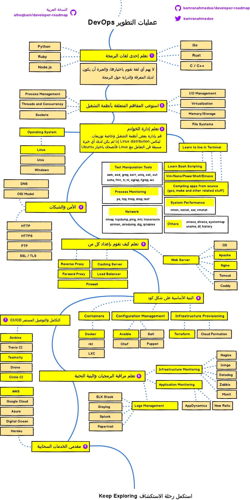

> An Arabic translation of the [Developer Roadmap](https://github.com/kamranahmedse/developer-roadmap) in 2018 by [kamranahmedse](https://github.com/kamranahmedse). 

أدناه ستجد مجموعة من الرسومات البيانية التي توضح المسارات التي يمكنك اتباعها والتقنيات الي تحتاجها لتصبح مطورًا للويب، سواءً لتطوير الواجهة الأمامية أو الطرف الخلفي للخادم أو عمليات التطوير. وقد قمت بعمل هذه الرسومات من أجل أحد أساتذتي الذي كان يرغب في مشاركتها مع طلابه.

Check out my [blog](http://kamranahmed.info) and say "hi" on [Twitter](https://twitter.com/kamranahmedse).

## <h2 dir='rtl' align='right'>إخلاء المسؤولية</h2>
> 
 الغرض من  هذه الخارطة هو إعطائك فكرة وتصور وتوجيهك في حال إرتباكك حول الخطوة القادمة وليس لتشجيعك على اختيار ما هو رائج وسائد. ينبغي عليك استيعاب سبب اختيار تقنية ما لتحقيق غرض معين وتذكر أن الرائج والسائد لا يعنه أنه الأنسب للقيام بالعمل.  

## <h2 dir='rtl' align='right'>🚀 المقدمة Introduction </h2>

## <h2 dir='rtl' align='right'> 🎨 خارطة الواجهة الأمامية Frontend Roadmap </h2>

## <h2 dir='rtl' align='right'> 👽 خارطة الطرف الخلفي Back-end Roadmap </h2> 

## <h2 dir='rtl' align='right'> 👷 خارطة عمليات التطوير DevOps Roadmap </h2> 

# Original Readme

> Roadmap to becoming a web developer in 2018

Below you find a set of charts demonstrating the paths that you can take and the technologies that you would want to adopt in order to become a frontend, backend or a devops. I made these charts for an old professor of mine who wanted something to share with his college students to give them a perspective.

Check out my [blog](http://kamranahmed.info) and say "hi" on [Twitter](https://twitter.com/kamranahmedse).

## Disclaimer
> The purpose of this roadmap is to give you an idea about the landscape and to guide you if you are confused about what to learn next and not to encourage you to pick what is hip and trendy. You should grow some understanding of why one tool would better suited for some cases than the other and remember hip and trendy never means best suited for the job

## 🚀 Introduction

## 🎨 Frontend Roadmap

## 👽 Back-end Roadmap

## 👷 DevOps Roadmap

## 🚦 Wrap Up

If you think any of the roadmaps can be improved, please do open a PR with any updates and submit any issues. Also, I will continue to improve this, so you might want to watch/star this repository to revisit.

## ☑ TODO

- [X] Add Frontend Roadmap
- [X] Add Backend Roadmap
- [X] Add DevOps Roadmap
- [ ] Add relevant resources for each

## 👬 Contribution

The roadmaps are built using [Balsamiq](https://balsamiq.com/products/mockups/). Project file can be found at `/project` directory. To modify any of the roadmaps, open Balsamiq, click **Project > Import > Mockup JSON**, it will open the roadmap for you, update it, upload and update the images in readme and create a PR.		

- Open pull request with improvements
- Discuss ideas in issues
- Spread the word
- Reach out with any feedback 

## Sponsored By

- [Hackr.io - Find & Share the Best Online Programming Courses & Tutorials](https://hackr.io)
- [Highig - Think and its done](http://highig.com/)

## License

